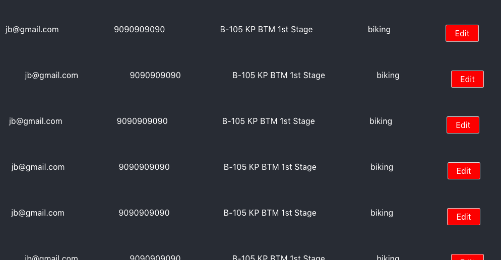

This is a basic config project

## Live link

https://dashboardapp-3cf11.firebaseapp.com/

In the project directory, you can run:

### `npm start`

This command will start your application locally

### `npm build`

This will build and create minified js and css bundle.

