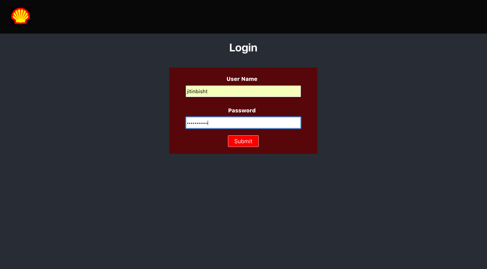
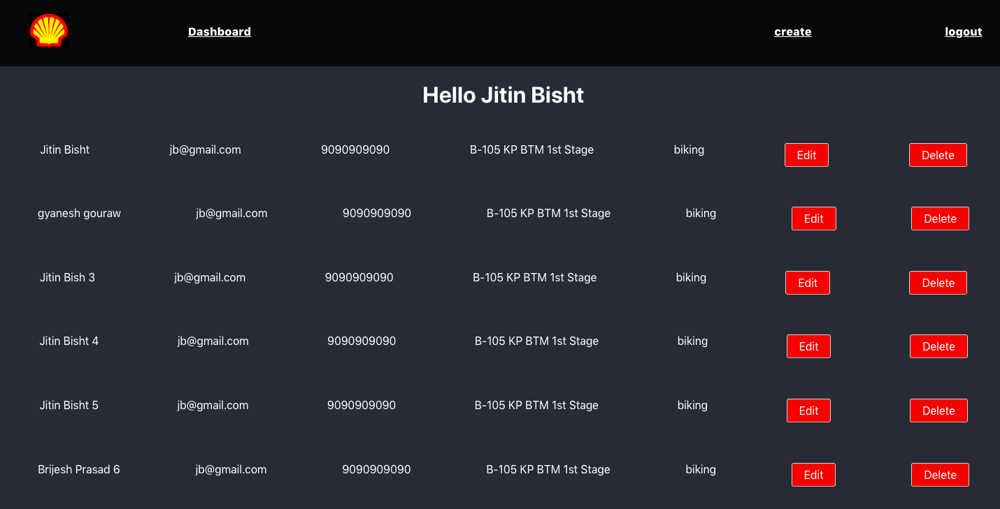
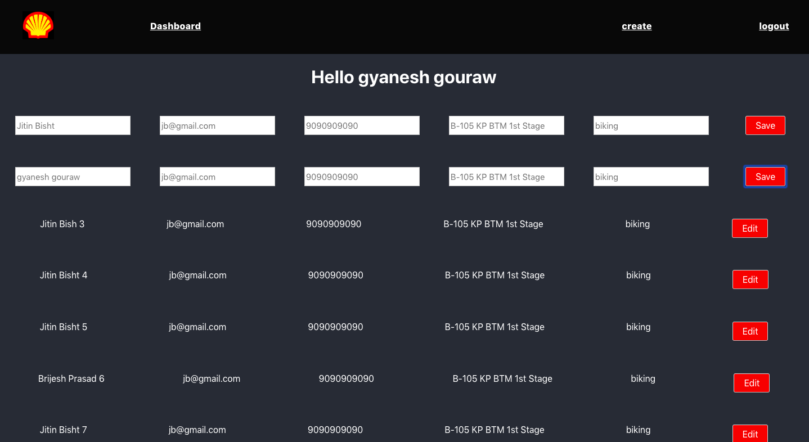

This is a basic config project

## Live link

https://dashboardapp-3cf11.firebaseapp.com/

In the project directory, you can run:

### `npm start`

This command will start your application locally

### `npm build`

This will build and create minified js and css bundle.

#### `Login Page`

- Page contains two fields "username" and "password".
- Role based users: Admin and Regular user.
- Admin and user have different login credentials.
- Admin credentials:
  username: jitinbisht
  password: jitinbisht

- Regular user credentials:
  username: gyaneshgouraw
  password: gyanesh123

### `Dashboard`

- Dashboard contains list of user of the application.

#### `Admin Dashboard`

- After Successful login, user can see the list of users in the  
  application.
- User is able to edit and delete any user by clicking the corresponding user row (Edit and Delete button
  in the last column)
- The details contain the columns such as Name,Email,Contact Number, Address, Edit and Delete.

#### `Regular User Dashboard`

- After Successful login, user is redirect to dashboard.
- User can see the list of users in the application.
- User is able to edit any user by clicking the corresponding user row (Edit button in the last column)
- The details contain the columns such as Name,Email,Contact Number, Address, Edit.

#### `Cookies Support`

- Added cookies support for login.
- State is preserved until user doesnot logs out.

#### `Header/Nav component`

- It contains Logo, Dashboard, Create New User and Logout Links.
- After successful login, on clicking the 'Logo' or 'Dashboard'  
  links, the user is redirected to dashboard journey.
- On clicking 'Create New User' link, the user is redirected to
  create page and it contains all form fields to add a new user.
- On clicking 'Logout' link, the user is logged out of the
  application and redirected to the Login page.

#### `Dashboard Regular User/Admin Details and Validations`

- The dashboard page contains below form fields along with validations:

  - Name (Mandatory, Text Min Length: 2, Text Max Length: 100).
  - Email (Mandatory, Text Min Length: 6, Text Max Length: 100): (should be valid email).
  - Contact Number (Mandatory, Text Min Length: 10, Text Max Length: 13) (+91 9999999999): Input should allow only + and digits.
  - Address (Mandatory, Text Min Length: 50, Text Max Length: 255).
  - Personal Interests & Hobbies (Optional, Text Min Length: 25, Text Max Length: 500).
  - A 'Regular user' or 'admin' can edit the details on the dashboard for each record by clicking 'Edit' button.
  - Only 'Admin' user can see the 'Delete' button and delete any record.
